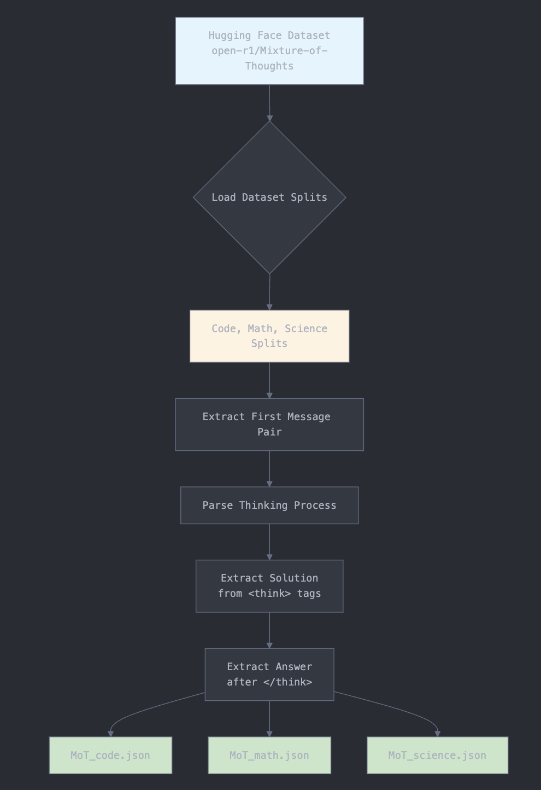

# Mixture of Thoughts Dataset Processing

## Overview

This module processes the [Mixture of Thoughts (MoT) dataset](https://huggingface.co/datasets/open-r1/Mixture-of-Thoughts) to extract structured question-solution-answer triplets from conversational data. The dataset contains AI-generated reasoning traces with explicit thinking processes wrapped in `<think>...</think>` tags.

## Processing Pipeline


## Prerequisites

### System Requirements
- Python 3.7 or higher
- Internet connection for downloading the dataset
- Approximately 500MB of free disk space

### Dependencies
```bash
pip install datasets
```

## Dataset Information

- **Source**: Hugging Face Hub - `open-r1/Mixture-of-Thoughts`
- **Splits**: `code`, `math`, `science`
- **Format**: Conversational data with structured reasoning
- **Key Features**:
  - Contains explicit reasoning traces in `<think>` tags
  - Multi-turn conversations with user questions and AI responses
  - Covers three domains: programming, mathematics, and science

## Processing Steps

### 1. Data Extraction
The script processes each split independently, focusing on the first user-assistant message pair from each conversation:

- **User Message**: Extracted as the question
- **Assistant Response**: Parsed to separate thinking process and final answer

### 2. Response Parsing
For each assistant response, the script:

1. **Identifies Thinking Boundaries**: Locates `<think>` and `</think>` tags
2. **Extracts Solution**: Captures all content within the thinking tags as the reasoning process
3. **Extracts Answer**: Captures content after the closing `</think>` tag as the final response
4. **Handles Edge Cases**: Skips malformed conversations that don't follow the expected format

### 3. Data Structuring
Each processed conversation is structured as:

```json
{
  "id": "MoT_{split}_{index}",
  "question": "The user's original question",
  "solution": "The complete thinking/reasoning process",
  "answer": "The final answer provided to the user"
}
```

## Usage

### Running the Processing Script

```bash
# Process all splits
python process_mot_dataset.py
```

The script will:
1. Download the dataset from Hugging Face (if not cached)
2. Process each split sequentially
3. Display progress for each split
4. Create output JSON files in `processed_mot_data/`

### Output Structure

```
processed_mot_data/
├── MoT_code.json      # Programming-related Q&A
├── MoT_math.json      # Mathematics problems and solutions
└── MoT_science.json   # Science questions and explanations
```

Each JSON file contains an array of processed conversations:

```json
[
  {
    "id": "MoT_code_0",
    "question": "Write a Python function to...",
    "solution": "Let me think through this step by step...",
    "answer": "Here's the Python function:..."
  },
  {
    "id": "MoT_code_1",
    "question": "How can I optimize...",
    "solution": "To optimize this, I need to consider...",
    "answer": "You can optimize by..."
  }
]
```

## Features

- **Robust Parsing**: Handles various formatting edge cases gracefully
- **Progress Tracking**: Real-time feedback during processing
- **Error Handling**: Skips malformed entries and reports statistics
- **Memory Efficient**: Processes data in streaming fashion
- **Deterministic IDs**: Consistent ID generation for reproducibility

## Troubleshooting

### Common Issues

1. **Missing Dependencies**
   ```bash
   pip install --upgrade datasets
   ```

2. **Network Errors**
   - Check internet connection
   - Try using a different network or VPN if Hugging Face is blocked

3. **Disk Space**
   - Ensure at least 500MB free space for dataset cache and output files

4. **Memory Issues**
   - The script processes data incrementally to minimize memory usage
   - If issues persist, consider processing splits individually

## Development

### Extending the Script

To process additional splits or modify the extraction logic:

1. Edit the `SPLITS` list in `process_mot_dataset.py`
2. Modify the `extract_think_content()` function for different parsing rules
3. Adjust the output format in the main processing loop

### Testing

Run with a subset of data for testing:
```python
# In process_mot_dataset.py, limit processing:
for idx, item in enumerate(dataset):
    if idx >= 10:  # Process only first 10 items
        break
    # ... rest of processing logic
```

## License

This processing script is provided as-is for educational and research purposes. Please refer to the original [Mixture of Thoughts dataset](https://huggingface.co/datasets/open-r1/Mixture-of-Thoughts) for licensing information regarding the data itself.