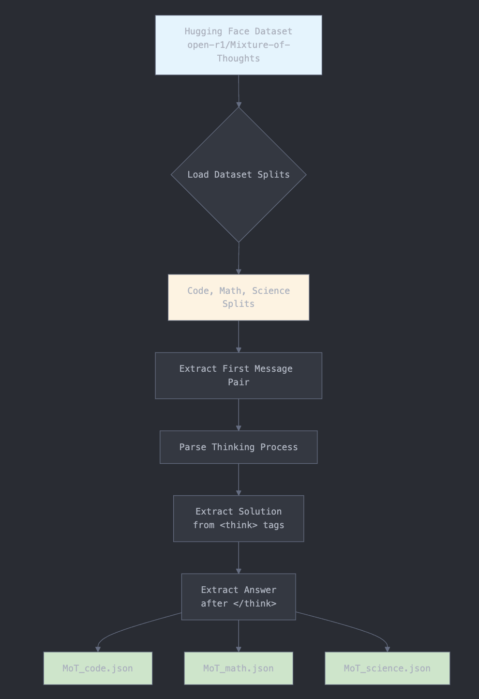

# Mixture of Thoughts データセット処理

## 概要

このモジュールは、[Mixture of Thoughts (MoT) データセット](https://huggingface.co/datasets/open-r1/Mixture-of-Thoughts)を処理して、会話データから構造化された質問-解決策-回答の三つ組を抽出します。このデータセットには、`<think>...</think>`タグで囲まれた明示的な思考プロセスを含むAI生成の推論トレースが含まれています。

## 処理パイプライン


## 前提条件

### システム要件
- Python 3.7以上
- データセットダウンロード用のインターネット接続
- 約500MBの空きディスク容量

### 依存関係
```bash
pip install datasets
```

## データセット情報

- **ソース**: Hugging Face Hub - `open-r1/Mixture-of-Thoughts`
- **分割**: `code`、`math`、`science`
- **形式**: 構造化された推論を含む会話データ
- **主な特徴**:
  - `<think>`タグ内に明示的な推論トレースを含む
  - ユーザーの質問とAIの応答を含む複数ターンの会話
  - 3つのドメインをカバー：プログラミング、数学、科学

## 処理ステップ

### 1. データ抽出
スクリプトは各分割を独立して処理し、各会話から最初のユーザー・アシスタントメッセージペアに焦点を当てます：

- **ユーザーメッセージ**: 質問として抽出
- **アシスタント応答**: 思考プロセスと最終回答を分離するために解析

### 2. 応答の解析
各アシスタント応答に対して、スクリプトは以下を実行します：

1. **思考境界の識別**: `<think>`と`</think>`タグを特定
2. **解決策の抽出**: 思考タグ内のすべてのコンテンツを推論プロセスとしてキャプチャ
3. **回答の抽出**: 閉じタグ`</think>`の後のコンテンツを最終応答としてキャプチャ
4. **エッジケースの処理**: 期待される形式に従わない不正な形式の会話をスキップ

### 3. データ構造化
処理された各会話は以下のように構造化されます：

```json
{
  "id": "MoT_{分割}_{インデックス}",
  "question": "ユーザーの元の質問",
  "solution": "完全な思考/推論プロセス",
  "answer": "ユーザーに提供される最終回答"
}
```

## 使用方法

### 処理スクリプトの実行

```bash
# すべての分割を処理
python process_mot_dataset.py
```

スクリプトは以下を実行します：
1. Hugging Faceからデータセットをダウンロード（キャッシュされていない場合）
2. 各分割を順次処理
3. 各分割の進行状況を表示
4. `processed_mot_data/`に出力JSONファイルを作成

### 出力構造

```
processed_mot_data/
├── MoT_code.json      # プログラミング関連のQ&A
├── MoT_math.json      # 数学の問題と解決策
└── MoT_science.json   # 科学の質問と説明
```

各JSONファイルには処理された会話の配列が含まれます：

```json
[
  {
    "id": "MoT_code_0",
    "question": "Python関数を書いて...",
    "solution": "ステップバイステップで考えてみましょう...",
    "answer": "これがPython関数です:..."
  },
  {
    "id": "MoT_code_1",
    "question": "どのように最適化できますか...",
    "solution": "これを最適化するには、考慮する必要があります...",
    "answer": "以下の方法で最適化できます..."
  }
]
```

## 機能

- **堅牢な解析**: さまざまなフォーマットのエッジケースを優雅に処理
- **進行状況追跡**: 処理中のリアルタイムフィードバック
- **エラー処理**: 不正な形式のエントリをスキップし、統計を報告
- **メモリ効率**: ストリーミング方式でデータを処理
- **決定論的ID**: 再現性のための一貫したID生成

## トラブルシューティング

### よくある問題

1. **依存関係の不足**
   ```bash
   pip install --upgrade datasets
   ```

2. **ネットワークエラー**
   - インターネット接続を確認
   - Hugging Faceがブロックされている場合は、別のネットワークまたはVPNを使用

3. **ディスク容量**
   - データセットキャッシュと出力ファイル用に少なくとも500MBの空き容量を確保

4. **メモリの問題**
   - スクリプトはメモリ使用量を最小限に抑えるためにデータを段階的に処理
   - 問題が続く場合は、分割を個別に処理することを検討

## 開発

### スクリプトの拡張

追加の分割を処理したり、抽出ロジックを変更するには：

1. `process_mot_dataset.py`の`SPLITS`リストを編集
2. 異なる解析ルールのために`extract_think_content()`関数を変更
3. メイン処理ループで出力形式を調整

### テスト

テスト用にデータのサブセットで実行：
```python
# process_mot_dataset.pyで、処理を制限：
for idx, item in enumerate(dataset):
    if idx >= 10:  # 最初の10アイテムのみ処理
        break
    # ... 残りの処理ロジック
```

## ライセンス

この処理スクリプトは、教育および研究目的でそのまま提供されています。データ自体に関するライセンス情報については、元の[Mixture of Thoughtsデータセット](https://huggingface.co/datasets/open-r1/Mixture-of-Thoughts)を参照してください。