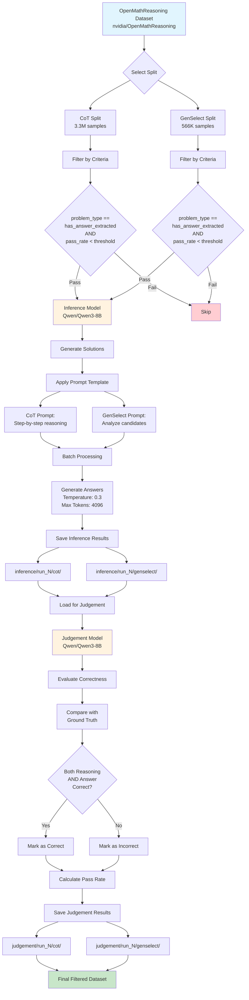

# OpenMath Reasoning Filtering System

## Overview

This system evaluates and filters mathematical questions from the [OpenMathReasoning dataset](https://huggingface.co/datasets/nvidia/OpenMathReasoning) based on difficulty assessment through model inference and correctness judgement. It processes two dataset splits (`cot` and `genselect`) to identify questions that meet specific difficulty criteria.

## Processing Pipeline



## Key Features

- **Two-Stage Processing**: Inference generation followed by correctness judgement
- **Dual Split Support**: Handles both Chain-of-Thought (CoT) and Generation Selection (GenSelect) formats
- **Difficulty Assessment**: Filters questions based on model pass rates
- **Batch Processing**: Efficient handling of large datasets with configurable batch sizes
- **Checkpoint System**: Saves intermediate results for resumability
- **Parallel Processing**: Supports tensor and pipeline parallelism for faster processing

## Dataset Information

### Source Dataset
- **Repository**: Hugging Face - `nvidia/OpenMathReasoning`
- **Splits Processed**:
  - **CoT**: ~3.3 million samples (Chain-of-Thought reasoning)
  - **GenSelect**: ~566,000 samples (Multiple choice selection)

### Filtering Criteria
- **problem_type**: Must be `has_answer_extracted`
- **pass_rate_72b_tir**: Must be numeric and below threshold (default: 0.3)

## Processing Stages

### Stage 1: Inference Generation

1. **Load Dataset**: Stream dataset split from Hugging Face
2. **Apply Filters**: Select only questions meeting criteria
3. **Generate Solutions**: Use inference model to solve problems
4. **Apply Prompts**:
   - **CoT**: Step-by-step mathematical reasoning
   - **GenSelect**: Analyze and select from candidates
5. **Save Results**: Store inference outputs in batches

### Stage 2: Correctness Judgement

1. **Load Inference Results**: Read generated solutions
2. **Prepare Judgement Prompts**: Combine question, ground truth, and generated solution
3. **Evaluate Correctness**: Judge both reasoning and final answer
4. **Binary Classification**: Mark as "yes" (correct) or "no" (incorrect)
5. **Save Judgements**: Store evaluation results

## Usage

### Basic Usage
```bash
python OpenMathReasoningFiltering.py
```

### Advanced Configuration
```bash
python OpenMathReasoningFiltering.py \
    --run-index 1 \
    --filter-by-pass-rate 0.3 \
    --inference-model "Qwen/Qwen3-8B" \
    --inference-batch-size 4 \
    --judgement-model "Qwen/Qwen3-8B" \
    --start-from-percentage 0.0 \
    --end-at-percentage 1.0
```

### Parallel Execution
```bash
# Process first half
python OpenMathReasoningFiltering.py --start-from-percentage 0.0 --end-at-percentage 0.5

# Process second half (in another terminal)
python OpenMathReasoningFiltering.py --start-from-percentage 0.5 --end-at-percentage 1.0
```

## Command Line Arguments

### Run Configuration
- `--run-index`: Run identifier for multiple executions (default: 1)
- `--filter-by-pass-rate`: Maximum pass rate threshold (default: 0.3)
- `--start-from-percentage`: Start processing from dataset percentage (default: 0.0)
- `--end-at-percentage`: End processing at dataset percentage (default: 1.0)

### Inference Model Parameters
- `--inference-model`: Model for solving problems (default: "Qwen/Qwen3-8B")
- `--inference-temperature`: Sampling temperature (default: 0.3)
- `--inference-max-tokens`: Maximum generation tokens (default: 4096)
- `--inference-max-model-len`: Maximum input length (default: 8192)
- `--inference-batch-size`: Batch size for inference (default: 4)
- `--inference-tp`: Tensor parallel size (default: 1)
- `--inference-pp`: Pipeline parallel size (default: 1)
- `--save-per-batch`: Save checkpoint every N batches (default: 100)

### Judgement Model Parameters
- `--judgement-model`: Model for evaluating answers (default: "Qwen/Qwen3-8B")
- `--judgement-temperature`: Temperature for judgement (default: 0.0)
- `--judgement-max-tokens`: Maximum tokens for judgement (default: 50)
- `--judgement-max-model-len`: Maximum input length (default: 8192)
- `--judgement-batch-size`: Batch size for judgement (default: 4)
- `--judgement-tp`: Tensor parallel size (default: 1)
- `--judgement-pp`: Pipeline parallel size (default: 1)
- `--judge-only-by-answer`: Judge only final answer, ignore reasoning

## Output Structure

```
results/
├── inference/
│   └── run_1/
│       ├── cot/
│       │   ├── inference_100.json
│       │   ├── inference_200.json
│       │   └── ...
│       └── genselect/
│           ├── inference_100.json
│           └── ...
└── judgement/
    └── run_1/
        ├── cot/
        │   ├── judgement_100.json
        │   └── ...
        └── genselect/
            ├── judgement_100.json
            └── ...
```

## Output Format

### Inference Output
```json
{
  "problem": "Solve for x: 2x + 5 = 13",
  "generated_solution": "Original solution from dataset",
  "inference": "Generated solution from inference model",
  "problem_type": "has_answer_extracted",
  "pass_rate_72b_tir": "0.25"
}
```

### Judgement Output
```json
{
  "problem": "Solve for x: 2x + 5 = 13",
  "generated_solution": "Original solution from dataset",
  "inference": "Generated solution from inference model",
  "judgement": "yes",
  "problem_type": "has_answer_extracted",
  "pass_rate_72b_tir": "0.25"
}
```

## Requirements

### Dependencies
```bash
pip install datasets torch vllm tqdm argparse
```

### System Requirements
- **GPU**: CUDA-capable GPU with sufficient VRAM
- **Memory**: Depends on model size and batch size
- **Storage**: Several GB for intermediate results
- **Python**: 3.7 or higher

## Performance Optimization

### Memory Management
- Uses `gpu_memory_utilization=0.95` for maximum GPU usage
- Employs `float16` precision to reduce memory footprint
- Clears GPU cache between inference and judgement stages

### Batch Processing
- Configurable batch sizes for both stages
- Checkpoint saving every N batches for resumability
- Streaming dataset loading to minimize memory usage

### Parallelization
- Supports tensor parallelism (TP) for model sharding
- Supports pipeline parallelism (PP) for stage distribution
- Can process dataset segments in parallel

## Troubleshooting

### Common Issues

1. **CUDA Out of Memory**
   ```bash
   # Reduce batch size
   python OpenMathReasoningFiltering.py --inference-batch-size 2 --judgement-batch-size 2
   
   # Use tensor parallelism
   python OpenMathReasoningFiltering.py --inference-tp 2 --judgement-tp 2
   ```

2. **Connection Errors**
   ```bash
   # Set environment variables for distributed processing
   export MASTER_ADDR=localhost
   export MASTER_PORT=29500
   export GLOO_SOCKET_IFNAME=lo
   ```

3. **Resume from Checkpoint**
   - The system automatically skips already processed batches
   - Check `results/inference/` and `results/judgement/` for existing files

4. **Dataset Download Issues**
   - Ensure stable internet connection
   - Check Hugging Face access permissions
   - Clear cache if corrupted: `rm -rf ~/.cache/huggingface/`

## Development Notes

### Extending the System

1. **Add New Models**: Modify `inference_model` and `judgement_model` parameters
2. **Custom Prompts**: Edit prompt templates in lines 115-162
3. **Different Datasets**: Adapt filtering criteria and dataset loading
4. **Scoring Metrics**: Implement custom evaluation beyond binary correctness

### Architecture Decisions
- **Two-model approach**: Separates generation from evaluation for flexibility
- **Streaming processing**: Handles large datasets without loading into memory
- **Checkpoint system**: Enables fault tolerance and parallel execution
- **Configurable prompts**: Supports different reasoning formats

## License

This tool is provided for research and educational purposes. Please refer to the [OpenMathReasoning dataset](https://huggingface.co/datasets/nvidia/OpenMathReasoning) for data licensing information.