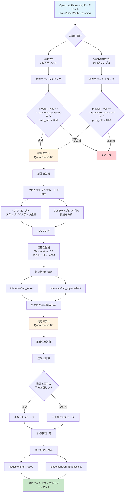

# OpenMath推論フィルタリングシステム

## 概要

このシステムは、[OpenMathReasoningデータセット](https://huggingface.co/datasets/nvidia/OpenMathReasoning)から数学の問題を評価し、モデル推論と正確性判定による難易度評価に基づいてフィルタリングします。特定の難易度基準を満たす問題を識別するために、2つのデータセット分割（`cot`と`genselect`）を処理します。

## 処理パイプライン



## 主要機能

- **2段階処理**: 推論生成に続いて正確性判定
- **デュアル分割サポート**: 思考の連鎖（CoT）と生成選択（GenSelect）形式の両方を処理
- **難易度評価**: モデル合格率に基づいて問題をフィルタリング
- **バッチ処理**: 設定可能なバッチサイズで大規模データセットを効率的に処理
- **チェックポイントシステム**: 再開可能性のために中間結果を保存
- **並列処理**: より高速な処理のためにテンソルとパイプライン並列をサポート

## データセット情報

### ソースデータセット
- **リポジトリ**: Hugging Face - `nvidia/OpenMathReasoning`
- **処理される分割**:
  - **CoT**: 約330万サンプル（思考の連鎖推論）
  - **GenSelect**: 約56.6万サンプル（多肢選択）

### フィルタリング基準
- **problem_type**: `has_answer_extracted`である必要がある
- **pass_rate_72b_tir**: 数値で、閾値未満である必要がある（デフォルト: 0.3）

## 処理段階

### 段階1: 推論生成

1. **データセット読み込み**: Hugging Faceからデータセット分割をストリーミング
2. **フィルター適用**: 基準を満たす問題のみを選択
3. **解答生成**: 推論モデルを使用して問題を解く
4. **プロンプト適用**:
   - **CoT**: ステップバイステップの数学的推論
   - **GenSelect**: 候補から分析して選択
5. **結果保存**: 推論出力をバッチで保存

### 段階2: 正確性判定

1. **推論結果読み込み**: 生成された解答を読み込む
2. **判定プロンプト準備**: 問題、正解、生成された解答を結合
3. **正確性評価**: 推論と最終回答の両方を判定
4. **二値分類**: "yes"（正解）または"no"（不正解）としてマーク
5. **判定保存**: 評価結果を保存

## 使用方法

### 基本的な使用方法
```bash
python OpenMathReasoningFiltering.py
```

### 高度な設定
```bash
python OpenMathReasoningFiltering.py \
    --run-index 1 \
    --filter-by-pass-rate 0.3 \
    --inference-model "Qwen/Qwen3-8B" \
    --inference-batch-size 4 \
    --judgement-model "Qwen/Qwen3-8B" \
    --start-from-percentage 0.0 \
    --end-at-percentage 1.0
```

### 並列実行
```bash
# 前半を処理
python OpenMathReasoningFiltering.py --start-from-percentage 0.0 --end-at-percentage 0.5

# 後半を処理（別のターミナルで）
python OpenMathReasoningFiltering.py --start-from-percentage 0.5 --end-at-percentage 1.0
```

## コマンドライン引数

### 実行設定
- `--run-index`: 複数実行用の実行識別子（デフォルト: 1）
- `--filter-by-pass-rate`: 最大合格率閾値（デフォルト: 0.3）
- `--start-from-percentage`: データセットのパーセンテージから処理開始（デフォルト: 0.0）
- `--end-at-percentage`: データセットのパーセンテージで処理終了（デフォルト: 1.0）

### 推論モデルパラメータ
- `--inference-model`: 問題解決用モデル（デフォルト: "Qwen/Qwen3-8B"）
- `--inference-temperature`: サンプリング温度（デフォルト: 0.3）
- `--inference-max-tokens`: 最大生成トークン数（デフォルト: 4096）
- `--inference-max-model-len`: 最大入力長（デフォルト: 8192）
- `--inference-batch-size`: 推論用バッチサイズ（デフォルト: 4）
- `--inference-tp`: テンソル並列サイズ（デフォルト: 1）
- `--inference-pp`: パイプライン並列サイズ（デフォルト: 1）
- `--save-per-batch`: Nバッチごとにチェックポイントを保存（デフォルト: 100）

### 判定モデルパラメータ
- `--judgement-model`: 回答評価用モデル（デフォルト: "Qwen/Qwen3-8B"）
- `--judgement-temperature`: 判定用温度（デフォルト: 0.0）
- `--judgement-max-tokens`: 判定用最大トークン数（デフォルト: 50）
- `--judgement-max-model-len`: 最大入力長（デフォルト: 8192）
- `--judgement-batch-size`: 判定用バッチサイズ（デフォルト: 4）
- `--judgement-tp`: テンソル並列サイズ（デフォルト: 1）
- `--judgement-pp`: パイプライン並列サイズ（デフォルト: 1）
- `--judge-only-by-answer`: 推論を無視して最終回答のみを判定

## 出力構造

```
results/
├── inference/
│   └── run_1/
│       ├── cot/
│       │   ├── inference_100.json
│       │   ├── inference_200.json
│       │   └── ...
│       └── genselect/
│           ├── inference_100.json
│           └── ...
└── judgement/
    └── run_1/
        ├── cot/
        │   ├── judgement_100.json
        │   └── ...
        └── genselect/
            ├── judgement_100.json
            └── ...
```

## 出力形式

### 推論出力
```json
{
  "problem": "xについて解く: 2x + 5 = 13",
  "generated_solution": "データセットからの元の解答",
  "inference": "推論モデルから生成された解答",
  "problem_type": "has_answer_extracted",
  "pass_rate_72b_tir": "0.25"
}
```

### 判定出力
```json
{
  "problem": "xについて解く: 2x + 5 = 13",
  "generated_solution": "データセットからの元の解答",
  "inference": "推論モデルから生成された解答",
  "judgement": "yes",
  "problem_type": "has_answer_extracted",
  "pass_rate_72b_tir": "0.25"
}
```

## 要件

### 依存関係
```bash
pip install datasets torch vllm tqdm argparse
```

### システム要件
- **GPU**: 十分なVRAMを持つCUDA対応GPU
- **メモリ**: モデルサイズとバッチサイズに依存
- **ストレージ**: 中間結果用に数GB
- **Python**: 3.7以上

## パフォーマンス最適化

### メモリ管理
- 最大GPU使用のために`gpu_memory_utilization=0.95`を使用
- メモリフットプリントを削減するために`float16`精度を採用
- 推論と判定段階の間でGPUキャッシュをクリア

### バッチ処理
- 両段階で設定可能なバッチサイズ
- 再開可能性のためにNバッチごとにチェックポイント保存
- メモリ使用を最小限にするためのストリーミングデータセット読み込み

### 並列化
- モデルシャーディング用のテンソル並列（TP）をサポート
- ステージ分散用のパイプライン並列（PP）をサポート
- データセットセグメントを並列処理可能

## トラブルシューティング

### よくある問題

1. **CUDAメモリ不足**
   ```bash
   # バッチサイズを削減
   python OpenMathReasoningFiltering.py --inference-batch-size 2 --judgement-batch-size 2
   
   # テンソル並列を使用
   python OpenMathReasoningFiltering.py --inference-tp 2 --judgement-tp 2
   ```

2. **接続エラー**
   ```bash
   # 分散処理用の環境変数を設定
   export MASTER_ADDR=localhost
   export MASTER_PORT=29500
   export GLOO_SOCKET_IFNAME=lo
   ```

3. **チェックポイントからの再開**
   - システムは既に処理されたバッチを自動的にスキップ
   - 既存ファイルは`results/inference/`と`results/judgement/`を確認

4. **データセットダウンロードの問題**
   - 安定したインターネット接続を確保
   - Hugging Faceアクセス権限を確認
   - 破損している場合はキャッシュをクリア: `rm -rf ~/.cache/huggingface/`

## 開発ノート

### システムの拡張

1. **新しいモデルの追加**: `inference_model`と`judgement_model`パラメータを変更
2. **カスタムプロンプト**: 115-162行目のプロンプトテンプレートを編集
3. **異なるデータセット**: フィルタリング基準とデータセット読み込みを適応
4. **スコアリングメトリクス**: 二値正確性を超えたカスタム評価を実装

### アーキテクチャの決定
- **2モデルアプローチ**: 柔軟性のために生成と評価を分離
- **ストリーミング処理**: メモリに読み込まずに大規模データセットを処理
- **チェックポイントシステム**: フォールトトレランスと並列実行を可能に
- **設定可能なプロンプト**: 異なる推論形式をサポート

## ライセンス

このツールは研究および教育目的で提供されています。データのライセンス情報については、[OpenMathReasoningデータセット](https://huggingface.co/datasets/nvidia/OpenMathReasoning)を参照してください。