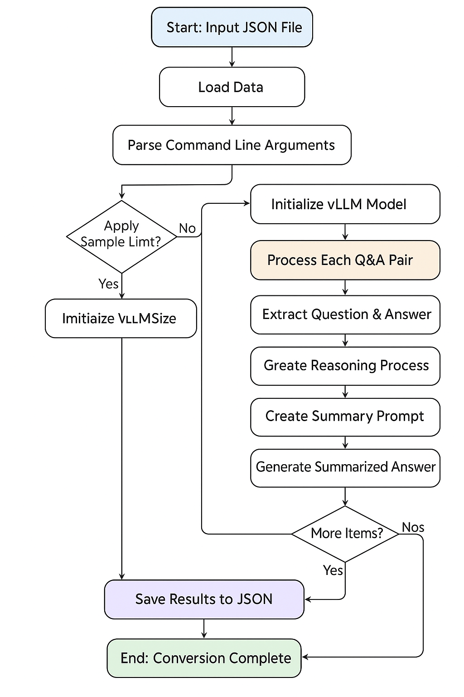

# History Data Conversion Tool

This tool converts historical Q&A data into a reasoning format using Large Language Models (LLMs). It processes original question-answer pairs to generate both reasoning processes and summarized answers.

## Overview

The conversion process transforms simple Q&A pairs into a structured format that includes:
- **Reasoning Process**: Detailed step-by-step thinking that leads to the answer
- **Summarized Answer**: Concise, direct response to the question

## Workflow Flowchart


## Detailed Process Flow

### 1. Data Loading
- **Input**: JSON file containing question-answer pairs
- **Format**: `[{"question": "...", "answer": "..."}, ...]`
- **Validation**: Ensures proper JSON structure and encoding

### 2. Model Initialization
- **Framework**: vLLM for efficient LLM inference
- **Default Model**: `Qwen/Qwen3-32B`
- **Configuration**: Tensor parallel processing, GPU memory optimization
- **Sampling Parameters**: Temperature=0.7, Top-p=0.9, Max tokens=2048

### 3. Processing Pipeline
For each question-answer pair:

#### Step 1: Reasoning Generation
```
Input: Question + Original Answer
Prompt: "Given this question and answer, please describe the reasoning process..."
Output: Detailed thinking process
Format: <think>reasoning_content</think>
```

#### Step 2: Summary Generation
```
Input: Question + Original Answer
Prompt: "Please summarize the original answer to the shortest possible answer..."
Output: Concise, direct answer
```

#### Step 3: Output Formatting
```
Final Output:
<think>reasoning_process</think>

summarized_answer
```

### 4. Result Structure
```json
{
  "id": "history_0",
  "question": "Original question",
  "output": "<think>reasoning...</think>\n\nsummary",
  "answer": "summarized_answer"
}
```

## Usage

### Basic Usage
```bash
python convert_history.py --input input.json --output output.json
```

### Advanced Options
```bash
python convert_history.py \
  --input input.json \
  --output output.json \
  --model "meta-llama/Llama-3.1-8B-Instruct" \
  --tp 4 \
  --limit 100
```

### Parameters
- `--input`: Input JSON file path (required)
- `--output`: Output JSON file path (required)
- `--model`: LLM model name (default: "Qwen/Qwen3-32B")
- `--tp`: Tensor parallel size (default: 2)
- `--limit`: Limit number of samples for testing

## Alternative Implementation

The repository also includes `test_openrouter_conversion.py` which provides:
- **OpenRouter API Integration**: Cloud-based LLM inference
- **Rate Limiting**: Built-in delays to avoid API limits
- **Error Handling**: Graceful failure handling for individual items
- **Sample Data**: Built-in test data for quick validation

### OpenRouter Usage
```bash
python test_openrouter_conversion.py \
  --input input.json \
  --output test_output.json \
  --model "qwen/qwen3-32b" \
  --limit 5
```

## Requirements

### Core Dependencies
- `vllm`: For local LLM inference
- `json`: Data serialization
- `argparse`: Command line argument parsing
- `logging`: Progress tracking and debugging

### OpenRouter Dependencies
- `requests`: HTTP API calls
- `os`: Environment variable access
- `time`: Rate limiting delays

## File Structure
```
history/
├── convert_history.py          # Main conversion script (vLLM)
├── test_openrouter_conversion.py  # Alternative implementation (OpenRouter)
└── README.md                   # This documentation
```

## Error Handling

### vLLM Implementation
- **Model Loading**: Validates model availability and GPU resources
- **Processing**: Continues processing even if individual items fail
- **Output**: Ensures proper JSON formatting and encoding

### OpenRouter Implementation
- **API Errors**: Handles network timeouts and API failures
- **Rate Limiting**: Built-in delays between requests
- **Partial Failures**: Continues processing remaining items on individual failures

## Performance Considerations

### vLLM (Local)
- **GPU Memory**: Configure `gpu_memory_utilization` based on available VRAM
- **Tensor Parallelism**: Adjust `tensor_parallel_size` for multi-GPU setups
- **Batch Processing**: Processes items sequentially for memory efficiency

### OpenRouter (Cloud)
- **Rate Limits**: 1-second delays between requests
- **API Costs**: Monitor usage based on model and token count
- **Network**: Handle potential connectivity issues

## Example Output

### Input
```json
{
  "question": "What were the main causes of World War I?",
  "answer": "World War I was caused by a complex web of factors including militarism, alliances, imperialism, and nationalism..."
}
```

### Output
```json
{
  "id": "history_0",
  "question": "What were the main causes of World War I?",
  "output": "<think>To understand the causes of World War I, I need to analyze the historical context of early 20th century Europe. The assassination of Archduke Franz Ferdinand was the immediate trigger, but underlying tensions had been building for decades. The system of alliances created a domino effect, while nationalism and imperialism fueled competition between European powers. The arms race and militarism created an environment where war seemed inevitable.</think>\n\nMilitarism, alliances, imperialism, nationalism, and the assassination of Archduke Franz Ferdinand.",
  "answer": "Militarism, alliances, imperialism, nationalism, and the assassination of Archduke Franz Ferdinand."
}
``` 