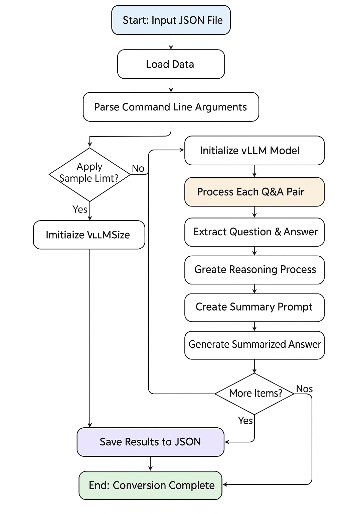

# 歴史データ変換ツール

このツールは、大規模言語モデル（LLM）を使用して歴史的なQ&Aデータを推論形式に変換します。元の質問と回答のペアを処理して、推論プロセスと要約された回答の両方を生成します。

## 概要

変換プロセスは、シンプルなQ&Aペアを以下を含む構造化された形式に変換します：
- **推論プロセス**: 回答に至る詳細なステップバイステップの思考
- **要約された回答**: 質問に対する簡潔で直接的な応答

## ワークフローフローチャート


## 詳細な処理フロー

### 1. データ読み込み
- **入力**: 質問と回答のペアを含むJSONファイル
- **形式**: `[{"question": "...", "answer": "..."}, ...]`
- **検証**: 適切なJSON構造とエンコーディングを確認

### 2. モデル初期化
- **フレームワーク**: 効率的なLLM推論のためのvLLM
- **デフォルトモデル**: `Qwen/Qwen3-32B`
- **設定**: テンソル並列処理、GPUメモリ最適化
- **サンプリングパラメータ**: Temperature=0.7、Top-p=0.9、最大トークン=2048

### 3. 処理パイプライン
各質問と回答のペアに対して：

#### ステップ1: 推論生成
```
入力: 質問 + 元の回答
プロンプト: "この質問と回答を踏まえて、推論プロセスを説明してください..."
出力: 詳細な思考プロセス
形式: <think>推論内容</think>
```

#### ステップ2: 要約生成
```
入力: 質問 + 元の回答
プロンプト: "元の回答を可能な限り短い回答に要約してください..."
出力: 簡潔で直接的な回答
```

#### ステップ3: 出力フォーマット
```
最終出力:
<think>推論プロセス</think>

要約された回答
```

### 4. 結果構造
```json
{
  "id": "history_0",
  "question": "元の質問",
  "output": "<think>推論...</think>\n\n要約",
  "answer": "要約された回答"
}
```

## 使用方法

### 基本的な使用方法
```bash
python convert_history.py --input input.json --output output.json
```

### 高度なオプション
```bash
python convert_history.py \
  --input input.json \
  --output output.json \
  --model "meta-llama/Llama-3.1-8B-Instruct" \
  --tp 4 \
  --limit 100
```

### パラメータ
- `--input`: 入力JSONファイルパス（必須）
- `--output`: 出力JSONファイルパス（必須）
- `--model`: LLMモデル名（デフォルト: "Qwen/Qwen3-32B"）
- `--tp`: テンソル並列サイズ（デフォルト: 2）
- `--limit`: テスト用のサンプル数制限

## 代替実装

リポジトリには`test_openrouter_conversion.py`も含まれており、以下を提供します：
- **OpenRouter API統合**: クラウドベースのLLM推論
- **レート制限**: API制限を回避するための組み込み遅延
- **エラー処理**: 個々のアイテムの優雅な失敗処理
- **サンプルデータ**: クイック検証用の組み込みテストデータ

### OpenRouterの使用方法
```bash
python test_openrouter_conversion.py \
  --input input.json \
  --output test_output.json \
  --model "qwen/qwen3-32b" \
  --limit 5
```

## 要件

### コア依存関係
- `vllm`: ローカルLLM推論用
- `json`: データシリアライゼーション
- `argparse`: コマンドライン引数解析
- `logging`: 進行状況追跡とデバッグ

### OpenRouter依存関係
- `requests`: HTTP APIコール
- `os`: 環境変数アクセス
- `time`: レート制限遅延

## ファイル構造
```
history/
├── convert_history.py              # メイン変換スクリプト（vLLM）
├── test_openrouter_conversion.py   # 代替実装（OpenRouter）
├── README.md                       # 英語版ドキュメント
└── README_ja.md                    # このドキュメント（日本語版）
```

## エラー処理

### vLLM実装
- **モデル読み込み**: モデルの可用性とGPUリソースを検証
- **処理**: 個々のアイテムが失敗しても処理を継続
- **出力**: 適切なJSONフォーマットとエンコーディングを確保

### OpenRouter実装
- **APIエラー**: ネットワークタイムアウトとAPI失敗を処理
- **レート制限**: リクエスト間の組み込み遅延
- **部分的な失敗**: 個々の失敗時に残りのアイテムの処理を継続

## パフォーマンスの考慮事項

### vLLM（ローカル）
- **GPUメモリ**: 利用可能なVRAMに基づいて`gpu_memory_utilization`を設定
- **テンソル並列性**: マルチGPUセットアップ用に`tensor_parallel_size`を調整
- **バッチ処理**: メモリ効率のためにアイテムを順次処理

### OpenRouter（クラウド）
- **レート制限**: リクエスト間で1秒の遅延
- **APIコスト**: モデルとトークン数に基づいて使用量を監視
- **ネットワーク**: 潜在的な接続問題を処理

## 出力例

### 入力
```json
{
  "question": "第一次世界大戦の主な原因は何でしたか？",
  "answer": "第一次世界大戦は、軍国主義、同盟、帝国主義、ナショナリズムを含む複雑な要因の網によって引き起こされました..."
}
```

### 出力
```json
{
  "id": "history_0",
  "question": "第一次世界大戦の主な原因は何でしたか？",
  "output": "<think>第一次世界大戦の原因を理解するには、20世紀初頭のヨーロッパの歴史的文脈を分析する必要があります。フランツ・フェルディナント大公の暗殺が直接的な引き金でしたが、根底にある緊張は何十年も蓄積されていました。同盟システムはドミノ効果を生み出し、ナショナリズムと帝国主義はヨーロッパ列強間の競争を煽りました。軍拡競争と軍国主義は、戦争が避けられないと思われる環境を作り出しました。</think>\n\n軍国主義、同盟、帝国主義、ナショナリズム、およびフランツ・フェルディナント大公の暗殺。",
  "answer": "軍国主義、同盟、帝国主義、ナショナリズム、およびフランツ・フェルディナント大公の暗殺。"
}
```

## トラブルシューティング

### よくある問題

1. **GPUメモリ不足**
   ```bash
   # テンソル並列数を増やす
   python convert_history.py --tp 4
   
   # またはより小さいモデルを使用
   python convert_history.py --model "Qwen/Qwen2-7B"
   ```

2. **モデル読み込みエラー**
   - モデル名が正しいことを確認
   - Hugging Faceトークンが設定されていることを確認（プライベートモデルの場合）
   - インターネット接続を確認

3. **JSON解析エラー**
   - 入力ファイルが有効なJSONであることを確認
   - UTF-8エンコーディングを使用していることを確認
   - JSONフォーマットツールで入力を検証

4. **OpenRouter API失敗**
   - APIキーが正しく設定されていることを確認
   - レート制限に達していないことを確認
   - モデルが利用可能であることを確認

## 開発ノート

### 拡張のアイデア
1. **バッチ処理**: 複数のアイテムを同時に処理してスループットを向上
2. **カスタムプロンプト**: ドメイン固有の推論生成のためのプロンプトテンプレート
3. **品質検証**: 生成された推論と要約の自動品質チェック
4. **複数言語サポート**: 異なる言語での入力/出力処理

### 貢献
コントリビューションは歓迎します！以下を含めてプルリクエストを送信してください：
- 変更の明確な説明
- 新機能のテスト
- ドキュメントの更新

## ライセンス

このツールは研究および教育目的で提供されています。使用するLLMモデルのライセンス条項を確認してください。