# ReasonMD Dataset Conversion

## Overview

This module provides a two-step pipeline for processing the ReasonMD medical dataset:
1. **Selection**: Uses length-based sampling with a half-Gaussian distribution to select high-quality samples from the streaming dataset
2. **Conversion**: Transforms selected data into structured SFT (Supervised Fine-Tuning) format with VLLM-extracted answers

The pipeline processes medical reasoning questions, extracts chain-of-thought outputs, and uses VLLM to generate concise final answers from verbose reasoning text.

## Dataset Processing Pipeline

```mermaid
flowchart TD
    A[HuggingFace Dataset<br/>lingshu-medical-mllm/ReasonMed] --> B[Step 1: Data Selection<br/>reasonmd_selector.py]
    
    B --> C[Stream Dataset]
    C --> D[Collect Length Statistics<br/>First 5000 samples]
    
    D --> E[Create Dynamic Bins<br/>Based on length distribution]
    E --> F[Apply Half-Gaussian Weights<br/>Favor longer outputs]
    
    F --> G{Reservoir Sampling}
    G --> H[Process Each Item]
    H --> I[Assign to Length Bucket]
    I --> J[Sample with Probability]
    
    J --> K[Selected Items<br/>reasonmd_selected.json]
    
    K --> L[Step 2: Data Conversion<br/>convert_reasonmd.py]
    
    L --> M[Load Selected Data<br/>or CoT_Medicine dataset]
    
    M --> N{For Each Row}
    
    N --> O[Extract Fields]
    O --> P[instruction → question]
    O --> Q[output → reasoning]
    
    P --> R{Validate}
    Q --> R
    
    R -->|Invalid| S[Skip Row]
    R -->|Valid| T[Process with VLLM]
    
    T --> U[Extract Answer<br/>from Reasoning]
    U --> V[VLLM Model<br/>Qwen/Qwen3-32B]
    
    V --> W[Parse Answer]
    W --> X{Answer Format<br/>Validation}
    
    X -->|Invalid| S
    X -->|Valid| Y[Create Structured Entry]
    
    Y --> Z[Format Output<br/>&lt;think&gt;reasoning&lt;/think&gt;<br/>answer]
    
    Z --> AA[Add to Results]
    S --> AB[Log Warning]
    
    AA --> AC{More Rows?}
    AB --> AC
    AC -->|Yes| N
    AC -->|No| AD[Save JSON File]
    
    AD --> AE[reasonmd_cot.json]
    
    style A fill:#e1f5fe
    style K fill:#d4edda
    style V fill:#fff3e0
    style AE fill:#c8e6c9
    style S fill:#ffcdd2
```



## Prerequisites

### System Requirements
- Python 3.7 or higher
- CUDA-capable GPU (for VLLM model inference)
- Sufficient GPU memory for model loading (32B parameter model)
- Internet connection for downloading dataset and model

### Dependencies
```bash
pip install datasets vllm tqdm transformers torch
```

### Configuration
- Hugging Face token stored in `../../keys.json`:
```json
{
  "llm": "your-huggingface-token-here"
}
```

## Dataset Information

### Primary Dataset (for selection)
- **Source**: Hugging Face Hub - `lingshu-medical-mllm/ReasonMed`
- **Mode**: Streaming (no full download required)
- **Content**: Large medical reasoning dataset

### Alternative Dataset (for direct conversion)
- **Source**: Hugging Face Hub - `neko-llm/CoT_Medicine`
- **Configuration**: `reasonmed_raw_selected`
- **Split**: `train`

### Data Fields
- **instruction**: Medical question or prompt
- **output**: Detailed reasoning process with answer
- **input**: Additional context (if present)

## Processing Components

### Step 1: Data Selection (`reasonmd_selector.py`)

#### 1.1 Length-Based Sampling
- **Statistics Collection**: Analyzes first 5000 samples for length distribution
- **Dynamic Binning**: Creates quantile-based bins for balanced sampling
- **Half-Gaussian Weighting**: Applies weights favoring longer outputs
- **Reservoir Sampling**: Efficiently selects samples from streaming data

#### 1.2 Selection Parameters
- `target_samples`: Number of samples to select (default: 500)
- `sample_size_for_stats`: Samples for statistics (default: 5000)
- `num_bins`: Number of length bins (default: 6)
- `curve_sharpness`: Half-Gaussian curve sharpness (default: 3.0)

### Step 2: Data Conversion (`convert_reasonmd.py`)

#### 2.1 Data Loading
- Loads selected data from `reasonmd_selected.json`
- Alternative: Direct loading from CoT_Medicine dataset

#### 2.2 Answer Extraction (`extract_answer_from_output`)
Uses VLLM to intelligently extract concise answers from verbose reasoning:

- **Input**: Question + Full reasoning output
- **Model**: Configurable (default: Qwen/Qwen3-32B)
- **Output**: Single letter (A-D) or specific medical term
- **Patterns Recognized**:
  - Direct answers: "A", "B", "C", "D"
  - Formatted answers: "Answer: D", "The answer is B"
  - Embedded answers: Extracts from longer text

### 3. Row Transformation (`transform_row`)
Processes each dataset row:

1. **Validation**: Checks for required fields
2. **Extraction**: Gets question and reasoning output
3. **Answer Generation**: Uses VLLM to extract final answer
4. **Format Validation**: Ensures answer meets quality criteria
5. **Structure Creation**: Builds formatted entry with think tags

### 4. Answer Validation (`basic_answer_format_check`)
Quality control for extracted answers:

- **Valid Formats**:
  - Single letters (A-D)
  - Medical terms (2-300 characters)
  
- **Invalid Indicators**:
  - Empty or too short answers
  - Phrases like "unable to extract", "cannot determine"
  - Excessively long responses

## Output Format

### JSON Structure
```json
[
  {
    "id": "reasonmed_0",
    "question": "A 45-year-old patient presents with...",
    "output": "<think>Let me analyze this case step by step...</think>\n\nB",
    "answer": "B"
  },
  {
    "id": "reasonmed_1",
    "question": "Which medication is contraindicated in...",
    "output": "<think>Reviewing the contraindications...</think>\n\nMetformin",
    "answer": "Metformin"
  }
]
```

### Fields
- **id**: Unique identifier (format: `reasonmed_{index}`)
- **question**: Original medical question from the dataset
- **output**: Combined reasoning and answer with think tags
- **answer**: Extracted final answer (concise)

## Usage

### Complete Two-Step Workflow

```bash
# Step 1: Select high-quality samples from streaming dataset
python reasonmd_selector.py --target_samples 1000 --num_bins 6

# Step 2: Convert selected data to SFT format with VLLM
python convert_reasonmd.py
```

### Step 1: Data Selection

```bash
# Basic selection (500 samples by default)
python reasonmd_selector.py

# Custom selection parameters
python reasonmd_selector.py \
    --target_samples 1000 \
    --sample_size_for_stats 5000 \
    --num_bins 8 \
    --curve_sharpness 4.0 \
    --output custom_selected.json

# Favor extremely long outputs
python reasonmd_selector.py --curve_sharpness 5.0 --num_bins 10
```

### Step 2: Data Conversion

```bash
# Convert selected data (uses reasonmd_selected.json by default)
python convert_reasonmd.py

# With custom model
python convert_reasonmd.py --model "meta-llama/Llama-3-70B"

# Test mode (first 5 entries)
python convert_reasonmd.py --test-mode --debug

# Multi-GPU processing
python convert_reasonmd.py --tp 2

# Full options
python convert_reasonmd.py \
    --model "Qwen/Qwen3-32B" \
    --tp 1 \
    --test-mode \
    --debug
```

### Alternative: Direct Conversion from CoT_Medicine
If you want to skip selection and directly convert from the CoT_Medicine dataset:

```bash
# This will load from neko-llm/CoT_Medicine instead of selected data
python convert_reasonmd.py
```

## Configuration Parameters

### VLLM Settings
- **Temperature**: 0.1 (low for consistent outputs)
- **Max Tokens**: 50 (optimized for short answers)
- **Top-p**: 0.9
- **Stop Tokens**: `["\n", ".", "```"]`
- **Max Model Length**: 8192 tokens

### Processing Options
- `--model`: VLLM model for answer extraction (default: Qwen/Qwen3-32B)
- `--tp`: Tensor parallel size for multi-GPU (default: 1)
- `--test-mode`: Process only 5 entries for testing
- `--debug`: Enable verbose debugging output

## Output Files

### Step 1: Selection Output
- **Default**: `reasonmd_selected.json`
- **Custom**: Specified via `--output` parameter
- **Content**: Selected raw dataset items with original structure

### Step 2: Conversion Output

#### Production Mode
- **Path**: `~/explore/data/hle/sft/medical/results/reasonmd_cot.json`
- **Content**: All successfully processed entries in SFT format

#### Test Mode
- **Path**: `~/explore/data/hle/sft/medical/results/reasonmd_cot_test.json`
- **Content**: First 5 processed entries for validation

## Error Handling

### Skip Conditions
Rows are skipped when:
1. Missing or empty `instruction` field
2. Missing or empty `output` field
3. Failed answer extraction
4. Invalid answer format

### Warnings
The script logs warnings for:
- Skipped rows with reasons
- Validation failures
- Processing errors

## Testing

### Unit Tests
```bash
# Run conversion tests
python test_reasonmd_conversion.py

# Quick test with shell script
./test_convert_reasonmd.sh
```

### Validation Steps
1. Check sample outputs for format compliance
2. Verify answer extraction accuracy
3. Ensure think tag formatting
4. Validate JSON structure

## Project Structure

```
reasonMD/
├── convert_reasonmd.py           # Main conversion script
├── test_reasonmd_conversion.py   # Unit tests
├── test_convert_reasonmd.sh      # Test shell script
├── reasonmd_selector.py          # Dataset selection utilities
├── product_requirement_document.md # Detailed specifications
└── README.md                     # This file
```

## Performance Considerations

### GPU Memory
- Model loading requires significant VRAM (varies by model)
- Use `--tp` parameter for multi-GPU distribution
- Consider smaller models for limited resources

### Processing Time
- Full dataset: Several hours depending on GPU
- Test mode: ~1-2 minutes
- Bottleneck: VLLM inference for answer extraction

## Troubleshooting

### Common Issues

1. **CUDA Out of Memory**
   ```bash
   # Use tensor parallelism
   python convert_reasonmd.py --tp 2
   
   # Or use smaller model
   python convert_reasonmd.py --model "Qwen/Qwen2-7B"
   ```

2. **Missing HF Token**
   - Ensure `keys.json` exists at `../../keys.json`
   - Verify token has dataset access permissions

3. **VLLM Installation**
   ```bash
   pip install vllm --upgrade
   ```

4. **Dataset Access Issues**
   - Check internet connection
   - Verify Hugging Face token validity
   - Ensure dataset is accessible with your account

## Development Notes

### Extending the Converter
To modify processing logic:

1. **Custom Answer Extraction**: Modify `extract_answer_from_output()`
2. **Validation Rules**: Update `basic_answer_format_check()`
3. **Output Format**: Adjust structure in `transform_row()`
4. **Model Configuration**: Change VLLM parameters in `main()`

### Adding New Features
- Batch processing for efficiency
- Multiple dataset configurations support
- Custom prompt templates for answer extraction
- Statistical analysis of processing results

## License

This conversion tool is provided for research and educational purposes. Please refer to the original [CoT_Medicine dataset](https://huggingface.co/datasets/neko-llm/CoT_Medicine) for data licensing information.