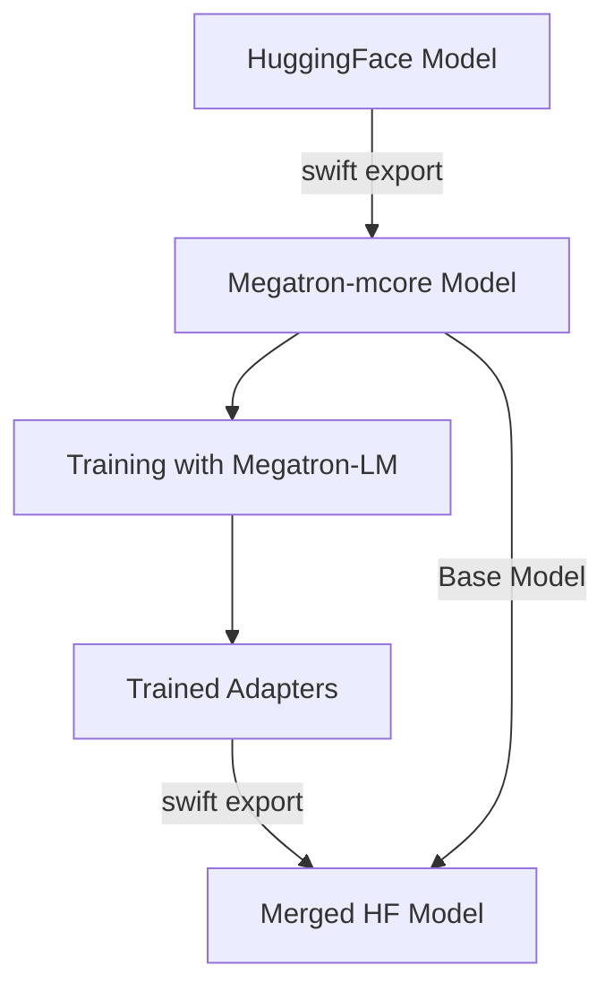

# Megatron-LM Training Environment Setup and Usage Guide

## 概要

このガイドでは、Singularityコンテナ環境でMegatron-LMを使用したモデルの変換と学習済みアダプターのマージ方法について説明します。

## 目次

1. [環境構築](#環境構築)
2. [Singularityイメージの作成](#singularityイメージの作成)
3. [HFモデルからMegatron-mcore形式への変換](#hfモデルからmegatron-mcore形式への変換)
4. [学習済みアダプターとHFモデルのマージ](#学習済みアダプターとhfモデルのマージ)
5. [トラブルシューティング](#トラブルシューティング)

## 環境構築

### 必要な要件

- NVIDIA GPU（8枚推奨）
- CUDA 12.x以上
- Singularity 3.8以上
- 十分なディスク容量（モデルサイズに依存、235Bモデルの場合は500GB以上推奨）

### 使用する主要ライブラリ

- **PyTorch**: NVIDIAの公式コンテナイメージ（25.05-py3）
- **ms-swift**: v3.8.1（Megatron-LM対応のモデル変換ツール）
- **Megatron-LM**: core_r0.13.0ブランチ
- **Flash Attention**: 効率的なアテンション計算用
- **DeepSpeed**: 分散学習用
- **Liger Kernel**: GPUメモリ効率化

## Singularityイメージの作成

### 1. Dockerfileの準備

提供されたDockerfileを`Dockerfile`として保存します。このDockerfileには以下の特徴があります：

- **ベースイメージ**: `nvcr.io/nvidia/pytorch:25.05-py3`（NVIDIA公式PyTorchイメージ）
- **PyTorchコンパイル無効化**: InductorErrorを回避
- **Megatron-LM**: GitHubから自動インストール（core_r0.13.0ブランチ）
- **ms-swift**: Megatron形式の変換に必要なツール

### 2. Dockerイメージのビルド

```bash
# Dockerイメージをビルド
docker build -t megatron-training:latest .

# ビルドの確認
docker images | grep megatron-training
```

### 3. SingularityイメージへのDocker イメージ変換

```bash
# Dockerイメージからsingularityイメージを作成
# 方法1: Docker Hubを経由する場合
docker tag megatron-training:latest your-dockerhub-username/megatron-training:latest
docker push your-dockerhub-username/megatron-training:latest
singularity pull megatron-training.sif docker://your-dockerhub-username/megatron-training:latest

# 方法2: ローカルでDocker イメージから直接変換する場合
singularity build megatron-training.sif docker-daemon://megatron-training:latest

# 方法3: Dockerfileから直接Singularityイメージを作成
singularity build megatron-training.sif docker://nvcr.io/nvidia/pytorch:25.05-py3
```

### 4. Singularityコンテナへの入り方

```bash
# GPUを有効にしてコンテナに入る
singularity shell --nv -B /home megatron-training.sif

# 書き込み可能モードで入る場合
singularity shell -w --nv -B /home megatron-training.sif
```

#### オプションの説明
- `--nv`: NVIDIA GPUサポートを有効化
- `-B /home`: ホストの/homeディレクトリをコンテナ内にマウント
- `-w`: 書き込み可能モード（一時的な変更用）

## HFモデルからMegatron-mcore形式への変換

### 1. 環境変数とリソース制限の設定

Singularityコンテナ内で以下を実行：

```bash
# リソース制限の解除
ulimit -s unlimited
ulimit -v unlimited
ulimit -n 65536
ulimit -u 32768

# GPU設定
export CUDA_VISIBLE_DEVICES=0,1,2,3,4,5,6,7
```

### 2. 変換スクリプトの実行

```bash
# モデル名を設定
export MODEL_NAME=Qwen3-235B-A22B-Thinking-2507

# megatron-mcore形式に変換
numactl --interleave=all \
swift export \
    --model /home/Competition2025/P05/shareP05/models/${MODEL_NAME} \
    --model_type qwen3_moe_thinking \
    --to_mcore true \
    --torch_dtype bfloat16 \
    --output_dir ${MODEL_NAME}-mcore
```

#### パラメータの説明

- `--model`: 変換元のHuggingFaceモデルのパス
- `--model_type`: モデルのタイプ（Qwen3 MoE Thinkingモデルの場合）
- `--to_mcore`: Megatron-mcore形式への変換を指定
- `--torch_dtype`: 使用するデータ型（bfloat16で精度とメモリ効率のバランス）
- `--output_dir`: 変換後のモデル出力先
- `numactl --interleave=all`: NUMA最適化によるメモリアクセス効率化

### 3. 変換の確認

```bash
# 変換されたファイルの確認
ls -la ${MODEL_NAME}-mcore/

# モデルのサイズ確認
du -sh ${MODEL_NAME}-mcore/
```

## 学習済みアダプターとHFモデルのマージ

### 1. マージスクリプトの準備

`merge_megatron_hf.sh`スクリプトを編集し、アダプターのパスを適切に設定：

```bash
#!/bin/bash
ulimit -s unlimited
ulimit -v unlimited
ulimit -n 65536
ulimit -u 32768

export CUDA_VISIBLE_DEVICES=0,1,2,3,4,5,6,7

# アダプターのパスを環境に合わせて変更
MCORE_MODEL_PATH="/home/Competition2025/P05/shareP05/models/Qwen3-235B-A22B-Thinking-2507-mcore/"
MCORE_ADAPTERS_PATH="/path/to/your/trained/adapters"
OUTPUT_DIR="./hf_output/output_Qwen3-merged/"

numactl --interleave=all \
swift export \
    --mcore_model ${MCORE_MODEL_PATH} \
    --mcore_adapters ${MCORE_ADAPTERS_PATH} \
    --to_hf true \
    --torch_dtype bfloat16 \
    --output_dir ${OUTPUT_DIR}
```

### 2. マージの実行

```bash
# Singularityコンテナ内で実行
bash merge_megatron_hf.sh
```

#### パラメータの説明

- `--mcore_model`: Megatron-mcore形式のベースモデルパス
- `--mcore_adapters`: 学習済みアダプターのパス
- `--to_hf`: HuggingFace形式への変換を指定
- `--torch_dtype`: データ型（bfloat16推奨）
- `--output_dir`: マージ後のモデル出力先

### 3. マージ結果の確認

```bash
# マージされたモデルの確認
ls -la ./hf_output/output_Qwen3-merged/

# config.jsonの確認
cat ./hf_output/output_Qwen3-merged/config.json

# モデルファイルのサイズ確認
du -sh ./hf_output/output_Qwen3-merged/*.safetensors
```

## ワークフロー全体の流れ



## ベストプラクティス

### メモリ最適化

1. **NUMA最適化**: `numactl --interleave=all`を使用してメモリアクセスを最適化
2. **データ型**: bfloat16を使用してメモリ使用量を削減
3. **Flash Attention**: 効率的なアテンション計算でメモリ使用量を削減

### GPUリソース管理

```bash
# GPU使用状況の監視
nvidia-smi -l 1

# 特定のGPUのみ使用
export CUDA_VISIBLE_DEVICES=0,1,2,3

# GPUメモリのクリア（必要に応じて）
nvidia-smi --gpu-reset
```

### データパスの管理

```bash
# 共有ストレージの設定（マルチノード学習時）
export MODELSCOPE_CACHE='/workspace/shared'

# Megatron-LMパスの確認
echo $MEGATRON_LM_PATH
```

## トラブルシューティング

### よくある問題と解決方法

#### 1. CUDA関連のエラー

```bash
# CUDAが利用可能か確認
python -c "import torch; print(torch.cuda.is_available())"

# CUDAバージョン確認
nvidia-smi
python -c "import torch; print(torch.version.cuda)"
```

#### 2. メモリ不足エラー

- データ型をfloat16またはbfloat16に変更
- バッチサイズを削減
- グラディエントチェックポインティングを有効化

#### 3. Megatron-LMインポートエラー

```bash
# Megatron-LMのパスを確認
ls -la $MEGATRON_LM_PATH

# Pythonパスに追加
export PYTHONPATH=$MEGATRON_LM_PATH:$PYTHONPATH

# インポートテスト
python -c "import megatron.training; print('Success!')"
```

#### 4. Swift exportエラー

```bash
# ms-swiftバージョン確認
pip show ms-swift

# 必要に応じて再インストール
pip install --upgrade ms-swift==3.8.1
```

### ログとデバッグ

```bash
# 詳細ログを有効化
export TORCH_DISTRIBUTED_DEBUG=DETAIL
export CUDA_LAUNCH_BLOCKING=1

# ログファイルへの出力
bash megatron_mcore_export.sh 2>&1 | tee export_log.txt
```

## 注意事項

1. **モデルサイズ**: 235Bパラメータのモデルは非常に大きいため、十分なディスク容量と帯域幅を確保
2. **GPU要件**: 8枚のGPU（V100/A100推奨）が必要
3. **時間**: 変換処理には数時間かかる場合があります
4. **バックアップ**: 重要なモデルは変換前にバックアップを取ることを推奨

## 参考リンク

- [ms-swift Documentation](https://github.com/modelscope/ms-swift)
- [Megatron-LM Repository](https://github.com/NVIDIA/Megatron-LM)
- [NVIDIA PyTorch Container](https://catalog.ngc.nvidia.com/orgs/nvidia/containers/pytorch)
- [Singularity Documentation](https://sylabs.io/guides/latest/user-guide/)

## サポート

問題が発生した場合は、以下の情報を含めて報告してください：

1. 使用環境（OS、GPUタイプ、メモリサイズ）
2. エラーメッセージの全文
3. 実行したコマンド
4. 関連するログファイル
